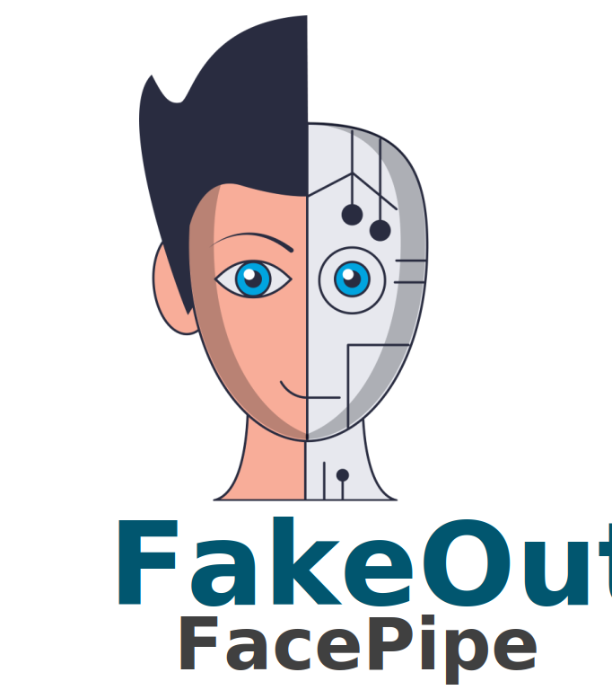

<div align="center">
</img>
</div>

<!-- # FakeOut -->
# FacePipe: The Official Implementation of the Face Tracking Pipeline of [FakeOut](https://github.com/gilikn/FakeOut)

## Setup
First, clone the repository:
```
cd /local/path/for/clone
git clone https://github.com/gilikn/FacePipe.git
```

Install requirements:
```
pip install requirements.txt
```

Run the main script with the relevant paths to your videos:
```
python main_face_tracking_pipeline.py
    --base_directory_path /path/to/your/dataset 
    --mean_face_path /path/to/20words_mean_face.npy
```

Finally, you can view your results in the directories defined for results, under the base_directory_path parameter.

## BibTex
If you find <i>FacePipe</i> useful for your research, please cite the <i>FakeOut</i> paper:
```bib
@article{knafo2022fakeout,
  title={FakeOut: Leveraging Out-of-domain Self-supervision for Multi-modal Video Deepfake Detection},
  author = {Knafo, Gil and Fried, Ohad},
  journal={arXiv preprint arXiv:2212.00773},
  year={2022}
}
```
